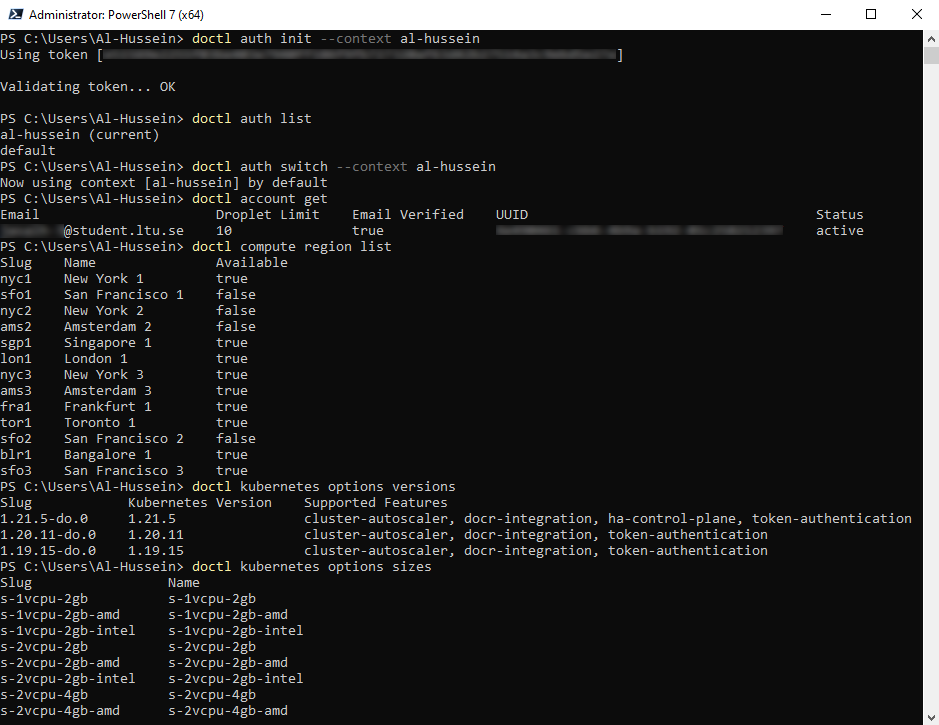
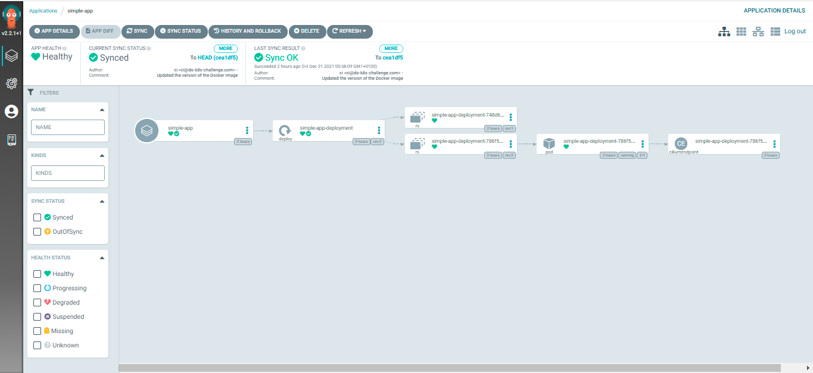
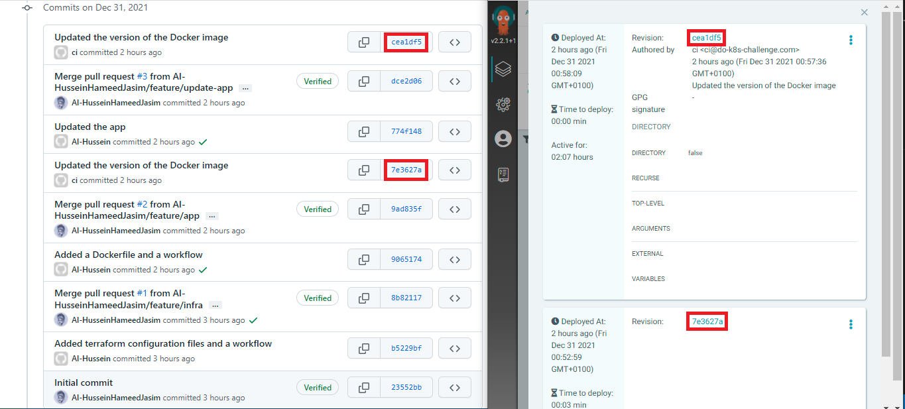

# DigitalOcean Kubernetes Challenge
This repository has been created for the DigitalOcean Kubernetes Challenge. The challenge is deploying a GitOps CI/CD implementation.
The first step was creating an account on the DigitalOcean (DO) cloud that comes with 100$ free credits valid for 2 months.

## Infrastructure provisioning
To provision the infrastructure, i.e. the Kubernetes cluster, and to deploy ArgoCD, I have used HashiCorp's [Terraform](https://www.terraform.io/). <br>
To remotely store the state file, I have configured a backend on DigitalOcean's space. <br>
```
terraform {
  backend "s3" {
    endpoint                    = "ams3.digitaloceanspaces.com"
    region                      = "eu-west-1"
    bucket                      = "<uniquename>"
    key                         = "terraform.tfstate"
    skip_credentials_validation = true
  }
}

```
To initialize the backend:
```
terraform init -backend-config="access_key=$access_key" -backend-config="secret_key=$secret_key"
```
Where both, the access key and the secret key are [Spaces access keys](https://cloud.digitalocean.com/account/api/tokens) which are different from the personal access tokens. The latter is also required for the DigitalOcean terraform provider.

#### doctl CLI
To interact with DO API via the command line, I have installed doctl on windows following this [guide](https://docs.digitalocean.com/reference/doctl/how-to/install/)
To authenticate, I have created a new personal access token in the DO portal.
To supply the [arguments](https://registry.terraform.io/providers/digitalocean/digitalocean/latest/docs/resources/kubernetes_cluster#argument-reference) of DigitalOcean Kubernetes cluster with values, I have run the following commands to retrieve the values as shown in the image below:



#### GitHub Actions
To fully automate the process, I have set up a workflow in Github Actions. The sensitive values such as the token and the secret key have been stored as secrets in GitHub.

Terraform outputs the Kubernetes cluster ID that is required to get its credentials added to the local kubeconfig file. To do so:
```
doctl kubernetes cluster kubeconfig save <cluster-id>
```
## Continuous Integration (CI)
To automate the application build process, I have set up a workflow that builds a Docker image and pushes it to a registry. <br>
This workflow also bumps the version of the Docker image in the Kubernetes deployment manifest upon a successful merge of a branch into the main branch. <br>
This is particularly important for the GitOps approach as the GitOps agent monitors the git repository and synchronizes the changes into the Kubernetes cluster.

## Continuous Delivery (CD)
To continuously deploy the latest version of the application into the Kubernetes cluster, ArgoCD has been used. ArgoCD is a widely used tool for Continuous Delivery following the GitOps model.

#### Access ArgoCD
To log in to the ArgoCD server:
```
export password=$(kubectl -n argocd get secret argocd-secret -o jsonpath="{.data.clearPassword}" | base64 -d)
argocd login <serverUrl> --username=admin --password=$password
```

#### Deploy an application
Once logged in, it becomes to deploy an application using ArgoCD. To do so, I have configured an application in a yaml file and have run the following command:
```
argocd app create -f argocd/simple-app.yaml
```
It is also possible to use the UI as shown in the image below:


ArgoCD updates the application once a new version has been released, i.e. the Docker image version in the deployment manifest has been updated.
Here's an example:


## There's a video, too!
I have also recorded a [video](https://youtu.be/z-VzqL4JxM4) showing the aforementioned steps with a plan to upload another one soon.
