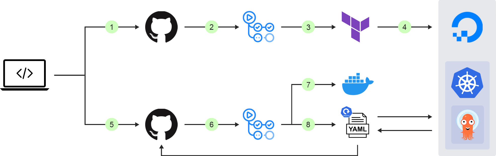
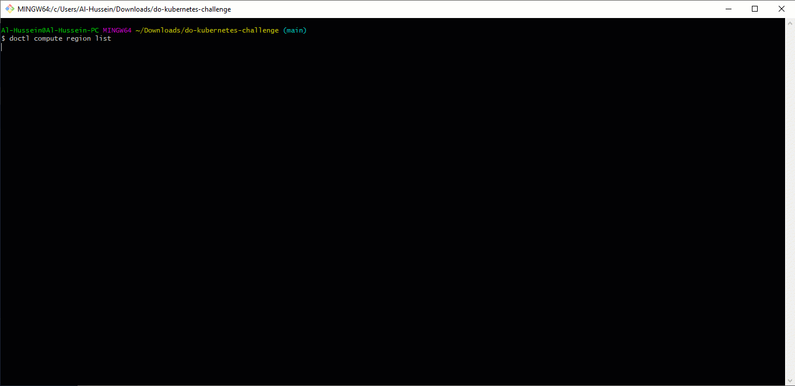
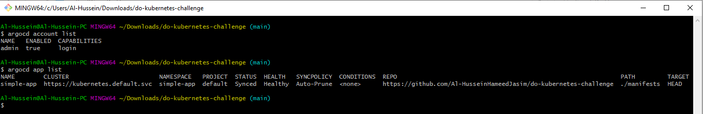
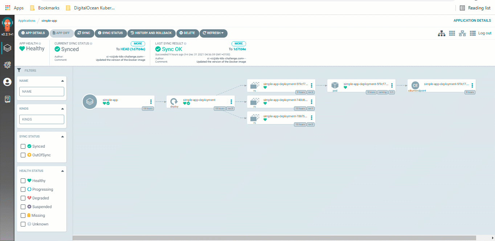

# DigitalOcean Kubernetes Challenge
The [DigitalOcean Kubernetes Challenge](https://www.digitalocean.com/community/pages/kubernetes-challenge) is to deploy a GitOps CI/CD implementation. <br>



The first step was creating an account on DigitalOcean that comes with a $100 free credit valid for two months.

## Infrastructure provisioning
To provision the infrastructure, i.e. the DigitalOcean managed Kubernetes cluster (DOKS) and to deploy Argo CD on top of, I have used HashiCorp's [Terraform](https://www.terraform.io/), an open-source Infrastructure as Code (IaC) tool. <br>
To remotely store the state file, I have configured an s3 compatible backend on a DigitalOcean space. <br>
```hcl
terraform {
  backend "s3" {
    endpoint                    = "ams3.digitaloceanspaces.com"
    region                      = "eu-west-1"
    bucket                      = "terraform-state"
    key                         = "terraform.tfstate"
    skip_credentials_validation = true
  }
}
```
To initialize the backend:
```
terraform init -backend-config="access_key=$access_key" -backend-config="secret_key=$secret_key"
```
Where both, the `access key` and the `secret key` are [Spaces access keys](https://cloud.digitalocean.com/account/api/tokens) which are different from the `personal access token`. The latter is also required for the DigitalOcean terraform provider.

#### doctl CLI
To interact with the DigitalOcean API via the command line, I have installed doctl, the official DigitalOcean CLI on windows following this [guide](https://docs.digitalocean.com/reference/doctl/how-to/install/). <br>
To authenticate, I have created a new personal access token in the DigitalOcean portal. <br>
To supply the [arguments](https://registry.terraform.io/providers/digitalocean/digitalocean/latest/docs/resources/kubernetes_cluster#argument-reference) of DigitalOcean Kubernetes cluster with values, I have run the following commands to retrieve the values as shown in the gif below:



The doctl commands to run are:
```bash
doctl auth init --context $CONTEXT # and enter the PAT
doctl auth list # lists the contexts
doctl auth switch --context $CONTEXT # switches to the recently created context
doctl account get # retrieves accounts details
doctl compute region list # lists the available regions such as ams3, fra1, etc.
doctl kubernetes options versions # lists the supported k8s versions
doctl kubernetes options sizes # lists the available nodes sizes
```
#### GitHub Actions
To fully automate the process, I have set up a workflow in Github Actions. The sensitive values such as the token and the secret key have been stored as secrets in GitHub.

Terraform outputs the Kubernetes `cluster ID` that is required to get its credentials added to the local kubeconfig file. To do so:
```
doctl kubernetes cluster kubeconfig save <cluster ID>
```
## Continuous Integration (CI)
To automate the application build process, I have set up a workflow that builds the Docker image and pushes it to Docker Hub. <br>
This workflow also bumps the version of the Docker image in the Kubernetes deployment manifest using [sed](https://www.baeldung.com/linux/sed-substitution-variables#:~:text=sh%0AMY_DATE%3D%24(date)-,sed%20%2Di%20%2Dr%20%22s/%5E(CURRENT_TIME%20%3D).*/%5C1%20%24MY_DATE/%22%20test.txt,-Now%2C%20let%E2%80%99s%20test) upon a successful [merge of a Pull Request](https://github.community/t/trigger-workflow-only-on-pull-request-merge/17359/9) (PR) into the main branch. <br>
This is particularly important for the GitOps approach given that the GitOps agent monitors the git repository as the single source of truth and synchronizes the desired state into the Kubernetes cluster.

## Continuous Delivery (CD)
To continuously deploy the latest version of the application into the Kubernetes cluster, I have used Argo CD, a widely used open-source GitOps operator for Kubernetes.
> GitOps is a set of principles, practices, and tools to manage infrastructure and application delivery using a developer-friendly tool, Git.

#### Access Argo CD
To [log in](https://github.com/bitnami/charts/blob/master/bitnami/argo-cd/templates/NOTES.txt#:~:text=echo%20%22Password%3A%20%24(kubectl%20%2Dn%20%7B%7B%20.Release.Namespace%20%7D%7D%20get%20secret%20argocd%2Dsecret%20%2Do%20jsonpath%3D%22%7B.data.clearPassword%7D%22%20%7C%20base64%20%2Dd)%22) to Argo CD server:
```
export password=$(kubectl -n argocd get secret argocd-secret -o jsonpath="{.data.clearPassword}" | base64 -d)
argocd login $serverUrl --username=admin --password=$password
```

#### Deploy an application
Once logged in, it becomes feasible to deploy an application using Argo CD. To do so, I have configured an application in a yaml manifest and have run the following Argo CD CLI command to create it:
```
argocd app create -f argocd/simple-app.yaml
```
To check the application status using Argo CD CLI:



It is also possible to use the UI as shown in the gif below:



Argo CD updates the application once a new version has been released, i.e. the Docker image version in the deployment manifest has been updated when a PR gets merged.

## And there's a video, too!
I have also recorded a walkthrough [video](https://youtu.be/z-VzqL4JxM4) showing the aforementioned steps.
